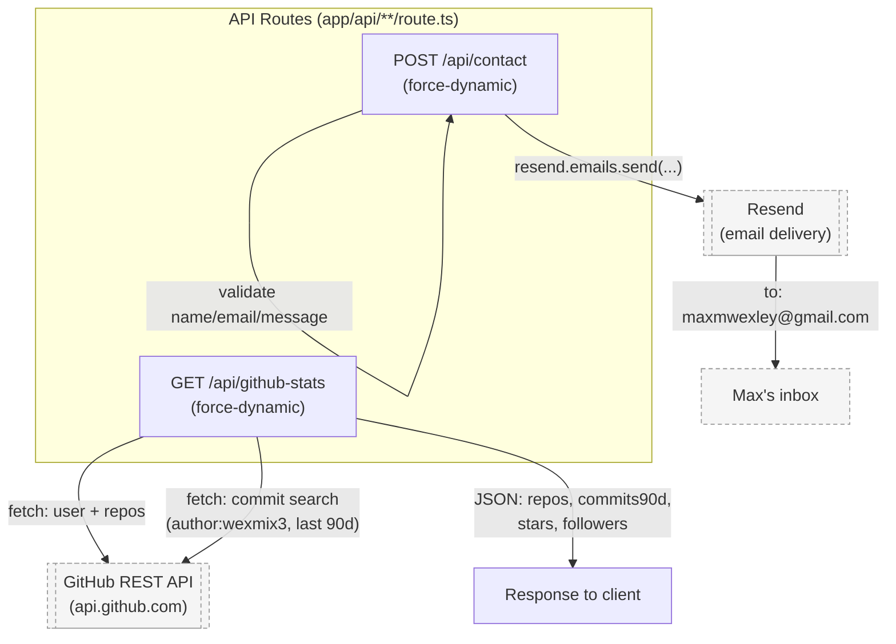

# Architecture

Static Next.js portfolio site (maxwexley.com). No cron jobs, no `trigger/*` tasks, no `lib/` layer — just two self-contained API routes. This is expected for a personal portfolio site, not a gap.

## Backend call graph

Generated by /architecture-map on 2026-08-18 — traced from code, not docs.

## Notes / mismatches

- No `vercel.json` `crons` entries — nothing on this site runs on a schedule. Both routes are request-triggered only (page load / form submit).
- No `lib/*` directory exists — both routes are self-contained, single-file handlers with no shared internal library to trace.
- `contact/route.ts` sends from `onboarding@resend.dev` (Resend's shared sandbox sender), not a wexadvisory.com or maxwexley.com address — worth knowing if deliverability on the contact form is ever questioned.
- `github-stats/route.ts` has no caching/rate-limit handling beyond `force-dynamic`; every page load re-hits three GitHub API endpoints (user, repos, commit search) live.
